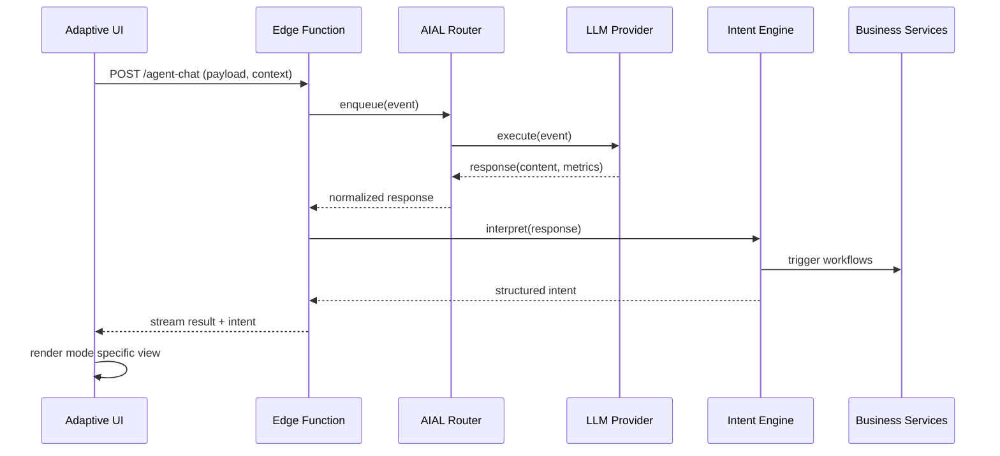

# AI Integration Architecture Diagram
**System Name:** AdvisorHub Adaptive AI Assistant (Mira)
**Version:** 1.0
**Date:** 2025-11-06

---

## Component Overview

```
+---------------------------+        +-----------------------+
| AdvisorHub Web Frontend   |        | AdvisorHub Mobile App |
| - React / Vite            |        | - React Native        |
| - Adaptive UI components  |        | - Shares intent API   |
+-------------+-------------+        +-----------+-----------+
              |                                  |
              v                                  v
        (HTTPS JSON)                      (HTTPS JSON)
              |                                  |
        +-----+----------------------------------+-----+
        |   API Gateway / Supabase Edge Functions     |
        |   - Auth (JWT)                               |
        |   - Rate limiting                            |
        |   - Logging / tracing                        |
        +-----+-----------+-----------+-----------+----+
              |           |           |           |
              |           |           |           |
              v           v           v           v
     +--------+--+  +-----+----+  +---+------+  +---+----------------+
     | AIAL Router |  | Intent DB |  | Telemetry |  | Provider Adapters |
     | - Normalizes |  | (Postgres) |  | Pipeline |  | - OpenAI          |
     | - Failover   |  |           |  | (Kafka)   |  | - Anthropic       |
     +--------+-----+  +----------+  +----------+  | - Custom REST      |
              |                                  +---+----------------+
              v
   +---------------------+
   | Business Services   |
   | - CRM Integrations  |
   | - Compliance API    |
   | - Notification Bus  |
   +---------------------+
```

---

## Data Flow

1. Frontend collects advisor input and contextual metadata (client id, advisor id, session info).
2. Request hits Supabase Edge Function (`agent-chat`) which authenticates and enriches with tenant metadata.
3. Edge Function forwards payload to AIAL Router.
4. Router evaluates provider health and selects primary adapter (OpenAI by default) with fallback to Anthropic then Custom REST.
5. Provider response returned with raw text and optional structured intent hints.
6. Intent interpreter maps raw output to canonical intent schema and persists to intent DB.
7. Interpreter dispatches events to Telemetry pipeline for observability and to Business Services for downstream workflows.
8. Result is streamed back to frontend where Adaptive UI updates mode specific panels.

---

## Sequence Diagram (Mermaid)



---

## Deployment View

Tier | Services | Scaling Notes
---- | -------- | -------------
Presentation | Vite/React SPA, React Native | Deployed via existing CI/CD, feature flag gating
Edge | Supabase Edge Functions (`agent-chat`, `shared-utils`) | Auto scale on request volume, cold start < 200ms
Integration | AIAL Router (Node runtime) | Containerized, horizontal scale with concurrency 10 per pod
Data | Postgres (Supabase), Redis cache | Managed services with daily snapshot backups
Providers | OpenAI, Anthropic, Vendor REST | Multi region endpoints with health monitoring
Observability | Datadog, BigQuery, PagerDuty | Unified dashboards, AI specific alerts

---

## Data Contracts

Payload | Source | Notes
------- | ------ | -----
`AIALEvent` | Frontend | Includes masked PII, request metadata
`ProviderResponse` | Provider adapters | Normalized fields for latency, tokens, optional intents
`MiraIntent` | Intent Engine | JSON document persisted to Postgres; triggers downstream jobs
`TelemetryEvent` | Edge -> Observability | Includes correlation ids for traceability

---

## Security Controls

- OAuth based advisor auth, JWT propagated to Edge Function
- PII scrubbing middleware before provider call
- Secrets stored in platform vault, rotated quarterly
- Audit logging for all AI requests (request id, user id, provider, latency)
- Provider allow list enforced at gateway level

---

## Integration Touchpoints

- CRM APIs for lead and policy data enrichment
- Notification service for advisor and client alerts
- Compliance rules engine for intent approval workflow
- Feature flag service (`launchdarkly`) controlling rollout per advisor cohort

---

## Change Management Checklist

- Update `AI_INTEGRATION_IMPLEMENTATION_PLAN.md` when new providers added
- Review data flow diagram quarterly with security
- Document new intents in `src/lib/aial/intent/catalog.ts`
- Align telemetry schema updates with data engineering team
